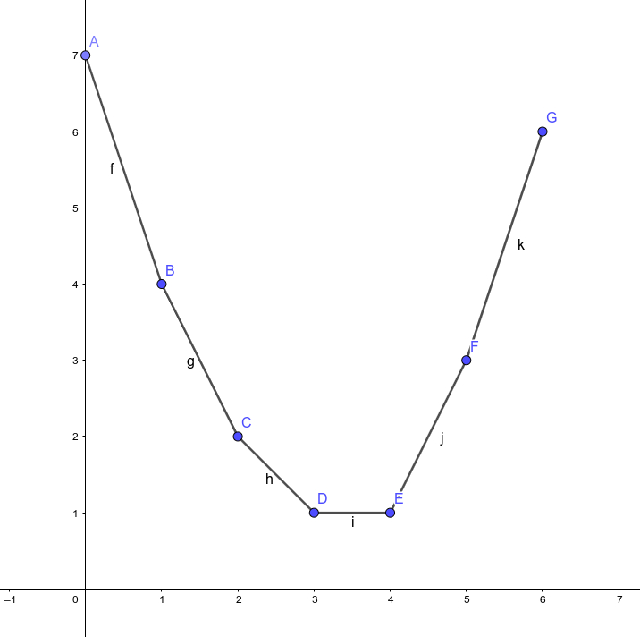
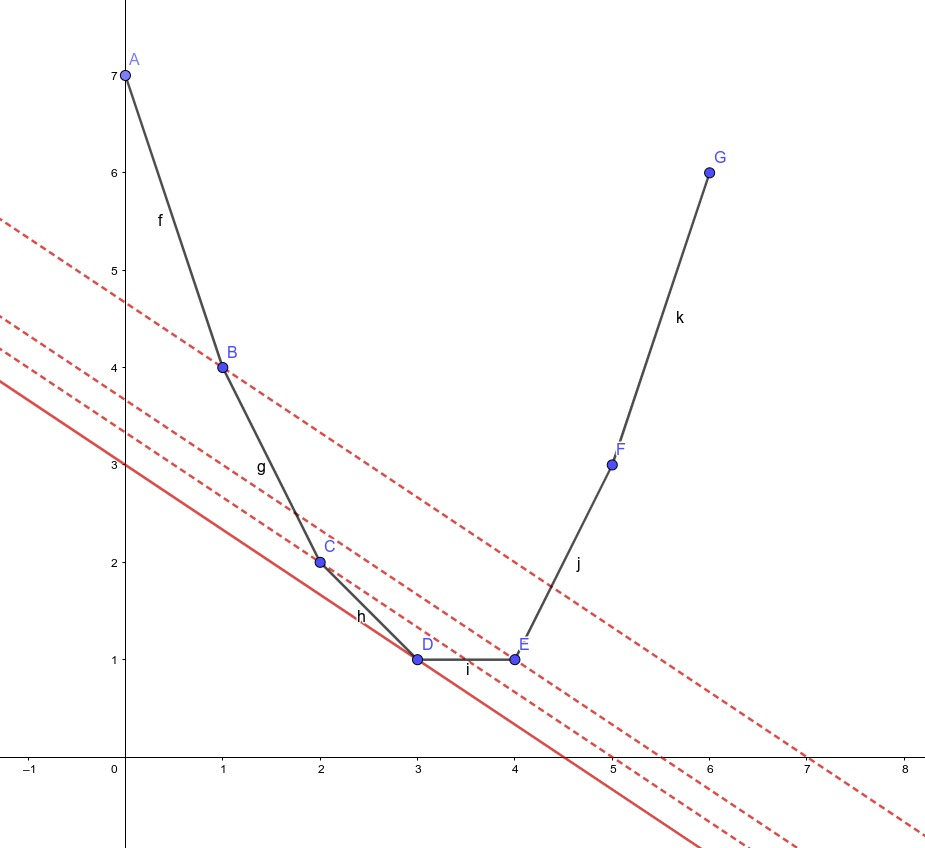

[TOC]

# 数学

## 线性代数

### 线性基

线性基擅长处理异或问题，值域为 $[1, N]$，可以用长为 $\lceil\log_2N\rceil$ 的数组来描述线性基。

特点：第 $i$ 位上的数在二进制下的最高位也是 $i$，线性基表示的集合 $S$ 中的任何数异或得到的结果都可以通过线性基异或得到。

#### 插入

对于插入的数 $x$，从高位向低位考虑，设当前考虑到了第 $i$ 位，

+   如果线性基没有第 $i$ 位，就让第 $i$ 位为 $x$，退出
+   否则就令 $x = x \bigoplus a_i$，继续操作

操作一次之后，$x$ 的最高位一定会变为 $0$，因此插入最多只会重复 $\log_2x$ 次。这种方法也同样可以判断数 $x$ 能否通过原集合 $S$ 里的数异或得到，如果最后 $x$ 依然不为 $0$，那么集合 $S$ 不可以异或得到 $x$

#### 查询最值

最小值：线性基里的最小值即为异或可得到的最小值。例外情况：线性基可以表示 $0$，此时直接返回 $0$ 即可

最大值：从高位向低位考虑，如果目前第 $i$ 位为 $0$，就令 $x=x\bigoplus a_i$。

#### 查询 k 小值

与查询最大值的过程类似。设线性基中有 $cnt$ 个数，那么线性基能表示 $2^{cnt}$ 个数。因此第 $k$ 小的值就应为 $\bigoplus\limits_{i=1}^n [2^i \And k]\cdot a_i$。但是和最小值一样，查询第 $k$ 小也需要考虑 $0$ 的情况。如果 $\abs {S} \ne cnt$，则线性基能表示$0$，查询第 $k-1$ 小值即可，查询代码类似快速幂。

#### 代码

```cpp
const int N = 30;

int a[N + 1];    // 线性基数组
bool flag;   // 线性基能否表示0

// 插入
void insert(int x) {
    for (int i = N; i >= 0; --i) {
        if ((x >> i) & 1) {
            if (a[i]) {
                x ^= a[i];
            } else {
                a[i] = x;
                return;
            }
        }
    }
    flag = true; // 最后被分解成原集合里一些数的异或和，说明能表示0
}


// 查询x能否表示为集合中的数的异或和
bool check(int x) {
    for (int i = N; i >= 0; --i) {
        if ((x >> i) & 1) {
            if (!a[i]) {
                return false;
            }
            x ^= a[i];
        }
    }
    return true;
}


// 查询能表示的最大值
// 如果给定参数，就代表查询与x异或的最大值
int query_max(int res = 0) {
    for (int i = N; i >= 0; --i) {
        res = max(res, res ^ a[i]);
    }
    return res;
}


// 查询能表示的最小值
int query_min() {
    if (flag) {
        return 0;
    }
    for (int i = 0; i <= N; ++i) {
        if (a[i]) {
            return a[i];
        }
    }
}


// 查询第k小值
int query(int k) {
    int res = 0, cnt = 0;
    k -= flag;
    if (!k) {
        return 0;
    }
    
    // 把线性基调整为极小线性无关组
    for (int i = 0; i <= N; ++i) {
        for (int j = i - 1; j >= 0; --j) {
            if ((a[i] >> j) & 1) {
                a[i] ^= a[j];
            }
        }
        // 统计线性基里有几个数
        if (a[i]) {
            ++cnt;
        }
    }
    
    if (k >= (1 << cnt)) {
		// k比线性基能表示的数的个数还大
        return -1;
    }
    
    for (int i = 0; i < cnt; ++i) {
        if ((k >> i) & 1) {
            res ^= a[i];
        }
    }
    return res;
}
```

#### 例题

+   [P3812 【模板】 线性基](https://www.luogu.com.cn/problem/P3812)
+   [P4151 [WC2011] 最大XOR和路径](https://www.luogu.com.cn/problem/P4151)

##### P4151 [WC2011] 最大XOR和路径

###### 题意

给定一张无向图，求从点 $S$ 到点 $T$ 路径上的异或和的最大值（路径可以重复走）。

###### 做法

一条路径由一条链和一个环组成，可以想到分开处理链和环的部分。

对于环的部分，直接找出图中所有的环，放到线性基里处理即可。对于链的部分，找一条 $1\sim n$ 的链，然后在线性基里求最大值。

有两个问题：如何选择链？如果线性基中选择的环不在这条链上也可以吗？

第一个问题，这条链任意选即可。假设有更优的一条链 $S$，那么 $S$ 与当前选择的链会构成一个环，会在线性基里处理掉。

第二个问题，可以从路径上任意一点引出一条到环上的路径，走过环后沿原路返回，这样路径上的值会被异或两次，对答案无影响。

<--! ## 数论

### 卷积&筛法

#### 杜教筛

#### gcd的处理

对于求$\gcd$的和，有：
$$
\begin{align}
  \gcd(i,j)&=\sum\limits_{k\mid \gcd(i,j)}\varphi(k)\\
  &=\sum\limits_{k\mid i, k \mid j}\varphi(k)\\
\end{align}
$$
然后可以通过交换求和顺序继续化简。

例[P3768](https://www.luogu.com.cn/problem/P3768)：
$$
\begin{align}
\sum\limits_{i=1}^n\sum\limits_{j=1}^nij\gcd(i,j)&=\sum\limits_{i=1}^n\sum\limits_{j=1}^nij\sum\limits_{k\mid i, k\mid j} \varphi(k)\\
&=\sum\limits_{k=1}^n\varphi(k)k^2\sum\limits_{i=1}^{\left\lfloor \tfrac nk \right\rfloor}\sum\limits_{j=1}^{\left\lfloor\tfrac nk\right\rfloor}ij\\
&=\sum\limits_{k=1}^n\varphi(k)\cdot k^2\cdot \frac{\left(\left\lfloor\frac nk\right\rfloor + 1\right)^2\left(\left\lfloor\frac n k\right\rfloor\right)^2} 4
\end{align}
$$
设函数$f(x)=\varphi(x)\cdot x^2\cdot$，因此要求$\sum\limits_{i=1}^n f(i) \cdot \dfrac{(\lfloor\dfrac nk\rfloor + 1)^2(\lfloor\dfrac n k\rfloor)^2} 4$。因为$\mu \ast \mathrm {id} = \varphi$，$\varphi \ast 1=\mathrm {id}$，考虑用杜教筛求和，取$g(x)= x^2$，所以有：
$$
\begin{align}
S(n) &= \sum\limits_{i=1}^n(g\ast f)(i) - \sum\limits_{i=2}^ni^2S\left(\left\lfloor\frac n i\right\rfloor\right)\\
(g\ast f)(i)&=\sum\limits_{d\mid i}f(d)g\left(\frac id\right)=\sum\limits_{d\mid i}\varphi(d) \cdot d^2\cdot\frac {i^2}{d^2}\\
&=i^2\sum\limits_{d\mid i}\varphi(d) = i^3\\
S(n)&=\sum\limits_{i=1}^ni^3-\sum\limits_{i=2}^ni^2S\left(\left\lfloor\frac n i\right\rfloor\right)=\frac {n^2(n+1)^2}4-\sum\limits_{i=2}^ni^2S\left(\left\lfloor\frac n i\right\rfloor\right)
\end{align}
$$
先数论分块，每次分块内部调用杜教筛算$S(n)$。 -->

# 动态规划

## 背包 DP

### 0-1 背包

已知 $n$ 个物品，他们的重量 $w_i$，价值 $v_i$ 和背包容量 $W$。

DP 状态为 $f(i,j)$ 表示只能放 $1\sim i$ 个物品，背包容量为 $j$ 时能达到的最大价值。转移方程为：
$$
f(i,j)=\max\left\{f(i-1,j), f(i-1,j-w_{i}) + v_i\right\}
$$
**滚动数组优化**：
$$
f_j=\max\{f_j, f_{j-w_i} + v_i\}
$$

>   [!WARNING]
>
>   滚动数组优化需要从后向前转移，才能保证每个物品只取一次的条件。

时间复杂度 $O\left(nW\right)$，空间复杂度 $O\left(W\right)$。

### 完全背包

与 0-1 背包类似，但是每个物品都可以选取无限次。

**滚动数组优化**：
$$
f_j=\max\{f_j, f_{j-w_i} + v_i\}
$$

>   [!WARNING]
>
>   这里的滚动数组需要从前向后转移，因为每个物品可以选取无限次，所以从前向后转移可以满足无限次选取的要求。

时间复杂度 $O\left(nW\right)$，空间复杂度 $O\left(W\right)$。

### 多重背包

与 0-1 背包类似，但是每种物品有 $k_i$ 个。

#### 朴素做法

将 $k_i$ 个物品展开为 $k$ 个价值相同、体积相同的物品，变成 0-1 背包模型。
$$
f(i,j)=\max\limits_{k=0}^{k_i}\{f(i-1, j-k\times w_{i}) + v_i\times k\}
$$
时间复杂度 $O\left(W \sum k_i\right)$。

#### 二进制拆分法

无论选择几个当前物品，一定可以把选择个数 $k$ 拆分成若干个 $2^i$ 个物品的和。

将物品拆成 $v = v_i \times2^j,w=w_i\times2^j$ 的物品（$j \in [0, \lfloor\log_2(k_i+1)\rfloor - 1]$），如果 $k_i + 1$ 为 $2$ 的整数次幂，则可以恰好分拆，否则需要添加一个 $k_i - 2^{\lfloor\log_2(k_i+1)\rfloor - 1}$ 大小的物品补全。

时间复杂度 $O\left(W\sum\log_2k_i\right)$。

#### 单调队列优化

TODO

时间复杂度 $O\left(nW\right)$。

>   [!TIP]
>
>   有时候二进制拆分比单调队列优化快。

### 二维费用背包

只需要多开一维存放第二种价值即可，转移方程基本一致。

### 分组背包

有 $n$ 件物品和一个大小为 $m$ 的背包，第 $i$ 个物品的价值为 $w_i$，体积为 $v_i$。同时，每个物品属于一个组，同组内最多只能选择一个物品，求背包能装载物品的最大总价值。

从“在所有物品中选择”变成了“从当前组中选择”，只需要对每一组做一次 0-1 背包即可。

```cpp
for (int k = 1; k <= T; ++k) {                // 枚举组
    for (int i = m; i >= 0; --i) {            // 枚举背包容量 滚动数组需要从后向前转移
        for (int j = 1; j <= cnt[k]; ++j) {   // 枚举组内每个物品
            if (i >= w[k][j]) {
                dp[i] = max(dp[i], dp[i - w[k][j]] + c[k][j]);
            }
        }
    }
}
```

如果要求可以从第 $i$ 组内选取不止一个物品，将第二层循环和第三层循环调换位置即可。

>   [!WARNING]
>
>   **转移顺序一定不能搞错**，才能保证正确性。

### 有依赖的背包

[P1064 金明的预算方案](https://www.luogu.com.cn/problem/P1064)

有 $n$ 块钱，想买 $m$ 个物品，第 $i$ 个物品的价格为 $v_i$，重要度为 $p_i$，有些物品是某个主件物品的附件，买这个物品必须购买它的主件，让所有购买的物品的 $v_i \times p_i$ 最大。

可以使用树形背包解决依赖性，要求选择儿子节点时必须选择父亲节点。当附件个数有限时，也可以讨论只买主件或买主件和某些附件。

### 变种

#### 输出方案

多开一个数组记录某一个状态是怎么转移过来的。可以用 $g_{i,v}$ 表示第 $i$ 件物品占用空间为 $v$ 时是否选择了这件物品。

#### 求方案数

求装到一定容量时的方案数。

把 DP 方程里的 $\max$ 换为求和即可。例如 0-1 背包的转移方程是：
$$
f_i=f_i+\sum f_{i-c_i}
$$
初始条件：$f_0=1$。

#### 求最优方案数

求最优方案数，需要把 $f_{i,j}$ 定义为前 $i$ 个物品恰好为 $j$ 容量时达到的最大价值，$g_{i,j}$ 为前 $i$ 个物品时背包体积恰好为 $j$ 容量时的方案数。

转移：

+   如果 $f_{i,j}=f_{i-1,j}$ 且 $f_{i,j}\ne f_{i-1,j-v} + w$，这说明该方案不放入第 $i$ 个物品更优，$g_{i,j}=g_{i-1,j}$
+   如果 $f_{i,j} \ne f_{i-1,j}$ 且 $f_{i,j}= f_{i-1,j-v} + w$，这说明该方案放入第 $i$ 个物品更优，$g_{i,j}=g_{i-1,j-v}$
+   如果 $f_{i,j}= f_{i-1,j}$ 且 $f_{i,j}= f_{i-1,j-v} + w$，这说明该方案放不放入都优，$g_{i,j}=g_{i-1,j-v}+g_{i-1,j}$

初值：$f_{0}=0,g_{0}=1$。

### 另一种看背包 DP 的视角

背包 DP 可以视为 $f_i$ 的多项式卷积的过程。

设一种新的卷积 $h=f\otimes g \rightarrow h_k = \max\limits_{i+j=k}\{f_i+g_j\}$。

+   0-1 背包和分组背包可表示成 $dp_i= dp_{i-1} \otimes f_i$，其中 $f_i$ 的第 $w_i$ 项为 $c_i$，第 $0$ 项为 $0$，其他项均为 $-\infty$
+   完全背包类似，$f_i$ 的第 $kw_i$ 项为 $kc_i$（$k\in\mathbb N^+$），第 $0$ 项为 $0$，其他项均为 $-\infty$
+   计数型 DP 

### 例题

+   [P2224 产品加工](https://www.luogu.com.cn/problem/P2224)
+   [P5289 皮配](https://www.luogu.com.cn/problem/P5289)


## 区间 DP

## 树形 DP

## 状压 DP

## 数位 DP

## 插头 DP

## 计数 DP

## 动态 DP

## 概率 DP

## 期望 DP

### 例题

+   [CF1265E Beautiful Mirrors](https://www.luogu.com.cn/problem/CF1265E)

#### CF1265E Beautiful Mirrors

一个人有 $n$ 面魔镜，每天她会问一面镜子，第 $i$ 面镜子有 $\dfrac {p_i} {100}$ 的概率告诉这个人她漂亮。这个人从第 $1$ 面镜子开始，每天询问一面镜子。如果第 $i$ 面镜子告诉她很漂亮，她第二天会询问第 $i + 1$ 面镜子；否则第二天回到第 $1$ 面镜子。求期望的询问天数，答案对 $998244353$ 取模。

设 $dp_i$ 为走到第 $i$ 面镜子后走到第 $n$ 面的期望天数。

在第 $i$ 面镜子时有两种情况：

+   镜子回答“漂亮”，花 $1$ 天走到下一面镜子，贡献是 $\dfrac {p_i} {100} \times (dp_{i + 1} + 1)$
+   镜子回答“不漂亮”，花 $1$ 天走到第 $1$ 面镜子，贡献是 $\dfrac {p_i}{100}\times (dp_{i+1}+1)$

所以：
$$
\begin{align}
dp_{i}&=\frac {p_i}{100}\times (dp_{i+1}+1) + \left(1- \frac {p_i}{100}\right)\left(dp_{1}+1\right)\\
&=\frac {p_i}{100}\times dp_{i+1} + \left(1-\frac {p_i}{100}\right)dp_1 + 1
\end{align}
$$
其中 $dp_{n+1}=0$。但是转移时很容易发现一个问题，目标状态是 $dp_1$，但是转移依赖于 $dp_1$ 的值，无法递推。

可以尝试推一下 $dp_1$ 的式子：
$$
\begin{align}
dp_1=\frac {p_1}{100} \times dp_2 &+ \left(1-\frac {p_1}{100}\right)\times dp_1 + 1\\
p_1\times dp_1&=p_1\times dp_2 + 1\\
dp_1&=dp_2+\frac 1 {p_1}
\end{align}
$$
再推一下 $dp_2$ 的式子：
$$
\begin{align}
dp_2=\frac {p_2}{1000} &\times dp_3 + \left(1-\frac {p_2}{1000}\right) \times dp_1 + 1\\
p_2\times dp_2&=p_2\times dp_3+\frac 1 {p_1} - \frac {p_2}{p_1} + 1\\
dp_2&=dp_3 + \frac {1}{p_1p_2} + \frac {1} {p_2} - \frac 1{p_1}\\
dp_1&=dp_3+\frac 1{p_1p_2} + \frac 1 {p_2}
\end{align}
$$
于是可以发现：$dp_1=\sum^n_{j=1}\prod^n_{k=i-j+1} \dfrac {100}{p_k}$。

## DP 优化

### 数据结构优化

#### 树状数组、线段树优化

考虑两个数组的最长上升子序列。

如果用 $f_{i,j}$ 表示第一个数组在 $i$ 位置，第二个数组在 $j$ 位置时的最长上升子序列的长度，那么时间复杂度为 $O\left(n^2\right)$。

如果**将 DP 过程中状态和值互换**，可以得到 $f_i$ 表示最长上升子序列长度为 $i$ 时，序列末尾最小值，用树状数组或线段树维护区间最小值即可，时间复杂度 $O\left(n\log n\right)$。

#### 单调队列优化

### 斜率优化

把一个序列划分成 $n$ 段，每段的价值为序列这段的权值和的平方加上 $M$，求每段价值和最小为多少。

设 $dp_{i}$ 表示前 $i$ 个数划分序列后的最小价值和，则转移方程为：
$$
\begin{align}
dp_i &= \min\limits_{k=0}^{i-1}\left\{dp_{k} + (S_{i} - S_{k})^2\right\} + M\\
&=\min\limits_{k=0}^{i-1}\left\{dp_k+S_k^2 - 2S_iS_k\right\}+M+S_i^2
\end{align}
$$
我们将 DP 的状态和值抽象为平面上的点，对于第 $i$ 个值有点 $P_i\left(S_i,dp_i + S_i^2\right)$。把上面转移方程中的 $S_k$ 当作自变量，可以得到类似 $\min\{kx + c_x\}$ 其中 $k=2S_i$。这条直线的斜率是固定的，实际上要求的就是这条直线的最小斜率。

考虑两个转移点 $j<k<i$ 且 $res_j < res_k$（$j$ 比 $k$ 优）的条件：
$$
\begin{align}
S_i^2+S_j^2-2S_iS_j+dp_j&<S_i^2+S_k^2-2S_iS_k+dp_k\\
\left(dp_j+S_j^2\right) - \left(dp_k+S_k^2\right) &< 2S_i(S_j-S_k)\\
\frac {\left(dp_j + S_j^2\right) - \left(dp_k+S_k^2\right)}{S_j-S_k}&> 2S_i=k
\end{align}
$$
不等式左侧正是 $P_j$ 和 $P_k$ 两点间直线的斜率表达式。假设 $A,B,C$ 三点不符合下凸壳，则 $k_{AB} > k_{AC} > k_{BC}$。

+   若 $k_{AC} > k$，$k_{AB} > k$，则 $A$ 比 $B$ 更优
+   若 $k_{AC} < k$，$k_{BC} < k$，则 $C$ 比 $B$ 更优

因此，$B$ 一定不优，所以可以只在凸壳上考虑。

### 决策单调性优化

对于最优化的 DP，每个点只能由一个最优状态转移而来。如果随着 DP 顺序的推进，每一个点的最优转移点也是单调移动的，那么就具有决策单调性。

设 $p_i$ 为 $f_i$ 取到最小值时的 $j$ 的值，所以 $p_i$ 是 $f_i$ 的最优决策，若 $p$ 在 $[1,N]$ 上单调不减，则称 $f$ 具有单调性。

#### 四边形不等式

一个二元函数 $w(a,b)$，对于 $p_1 \le p_2 \le p_3 \le p_4$，如果总有 $w(p_1,p_4)+ w(p_2,p_3)\ge w(p_1,p_3) + w(p_2,p_4)$ 成立，则函数 $w$ 满足四边形不等式。

在形如 $f_i = \min\limits_{0\le j<i}\{f_j + w(j,i)\}$ 的方程中，如果函数 $w$ 满足四边形不等式，则 $f$ 具有决策单调性。

#### 优化实现

当 $f$ 具有决策单调性时，我们可以把计算 $f_i = \min\limits_{0\le j < i}\{f_j + w(j,i)\}$ 的时间复杂度从 $O\left(N^2\right)$ 降低到 $O\left(\log N\right)$。

考虑维护 $p$ 这个数组，起初时 $p$ 全部为 $0$。当求出一个新的 $f_i$ 时，我们应该考虑 $i$ 可以作为哪些后续状态的最优决策。根据决策单调性，一定能找到一个位置：在该位置之前的决策都比 $i$ 更优，在该位置之后的所有决策都比 $i$ 更差。所以需要快速找到这个位置，并把之后的决策都修改为 $i$。

直接查找和修改太慢，无法接受，可以用一个队列代替 $p$ 数组。队列中保存若干个三元组 `(j, l, r)`。$j$ 表示决策，$l$ 和 $r$ 表示当前 $p_l\sim p_r$ 的值都为 $j$。

之后，从队尾开始检查：

+   如果整个决策都不如 $i$，即 $f_i + w(i,l_j) \le f_j + w(j,l_j)$，就整个删去
+   否则，在当前决策中二分查找，然后将不优的一半删去

最后，将决策 $i$ 入队。

### WQS 二分

给定一些带有价值的物品，价值可以为负，对于物品的选择有一定的限制，要求最大化 / 最小化权值。

例 [P2619 Tree I](https://www.luogu.com.cn/problem/P2619)：

有一张无向带权连通图，每条边是黑色或白色，要找一棵恰好有 $N$ 条白边的最小生成树，输出最小边权和。

#### 设计函数

首先需要设计一个函数 $f(x)$ 表示当恰好选择 $x$ 条白边时的最小生成树的权值和。

在一个定值 $x=c$ 之前，$f(x)$ 一定是单调递增的，此时存在一条白边的权值小于最小生成树中黑边的最大边权，于是随着选择的白边的数量增加，一定可以用边权更小的白边替换黑边。

达到 $c$ 之后，再用白边替换黑边会使得总边权增加，因此函数是一个下凸壳。函数图像类似如下：



对于任意一个斜率，最多有一条该斜率的直线与凸壳相切。而且斜率越小，对应的切点的横坐标也最小。只要能求出 $x$ 和对应的 $f(x)$，就可以尝试二分这个斜率，得到这个切点。

下凸壳有一个性质：对于同一斜率 $k$ 的直线过凸壳上一点，过切点的直线纵轴截距最小：



则该截距为 $g(x) = f(x) - kx$。$g(x)$ 意味着选取 $x$ 条白边时，每条白边的价值减 $k$ 后，能得到的最优解。

有一个性质：切点上的 $g(x)$ 为每一条白边的价值减 $k$ 后，没有额外限制的全局最优解。

因为凸壳上切点处的直线截距一定是所有截距中最小的，因此切点上的 $g(x)$ 一定是所有点上 $g(x)$ 的最优的。因此我们就可以在每一次二分斜率 $k$ 后，直接求出当前每条白边边权减小 $k$ 后的最优解，同时记录最优解需要的白边数量，最后把最优解加上 $kx$ 就得到了答案。

# 字符串

## 后缀数据结构

### 后缀树

后缀树是一棵**压缩字典树**，存储的是字符串的所有后缀。

后缀树有以下特点：

+   后缀树上每一条边存储了两个整数 `from` 和 `to`，代表的是文本中 $[from, to]$ 的部分
+   从根节点出发走过的任意部分都是原字符串的子串
+   后缀树上有后缀链接，类似 AC 自动机的 `fail` 指针，指向的是后缀的真后缀的位置

#### Ukkonen构建方法[^1]

Ukkonen算法记录了一个三元组 `(active_node, active_edge, active_length)`，以及 `remainder`。

+   `active_node` 表示当前最长隐式后缀的位置
+   `active_edge` 表示当前最长隐式后缀从 `active_node` 出发走向的边
+   `active_length` 表示当前最长隐式后缀的长度
+   `remainder` 表示的是还需要插入多少个后缀

初始时，每条边为 $[i,+\infty]$，每个点的后缀链接均指向 `root`，然后按照以下规则插入：

+   每次插入操作进行时，如果 `remainder` 为 $0$，将 `remainder` 设置为 $1$
+   当向根节点插入时：
    +   `active_node` 保持为 `root`
    +   `active_edge` 被设置为即将插入的新后缀的首字符
    +   `active_length` 减 $1$
+   当分裂一条边并插入新节点时，如果该节点不是当前步骤中第一个插入的节点，从上一个插入的节点创造一个后缀链接指向当前节点
+   当从 `active_node` 不为 `root` 的节点分裂边时，沿着后缀链接的方向寻找节点，将该节点设置为 `active_node`

#### 例题

##### [P3804 后缀自动机](https://www.luogu.com.cn/problem/P3804)

```cpp
constexpr int N = 1e6+5;

int lnk[N << 1], s[N << 1], len[N << 1], start[N << 1], ch[N << 1][27], rem, now = 1, tail = 1;
int n;

int newnode(int st, int le) {
	lnk[++tail] = 1;
	start[tail] = st;
	len[tail] = le;
	return tail;
}

void insert(int x) {
	s[++n] = x;
	++rem;
	for (int last = 1; rem;) {
		while (rem > len[ch[now][s[n - rem + 1]]]) {
			rem -= len[now = ch[now][s[n - rem + 1]]];
		}
		int &v = ch[now][s[n - rem + 1]];
		int c = s[start[v]+rem - 1];
		if (!v || c == x) {
			lnk[last] = now;
			last = now;
			if (!v) {
				v = newnode(n, 0x3f3f3f3f);
			} else {
				break;
			}
		} else {
			int u = newnode(start[v], rem - 1);
			ch[u][c] = v;
			ch[u][x] = newnode(n, 0x3f3f3f3f);
			start[v] += rem - 1;
			len[v] -= rem - 1;
			v = u;
			lnk[last] = v;
			last = u;
		}
		if (now == 1) {
			--rem;
		} else {
			now = lnk[now];
		}
	}
}
```

[^1]:[完整的构建过程](https://www.cnblogs.com/gaochundong/p/suffix_tree.html)，[演示网站](https://brenden.github.io/ukkonen-animation/)